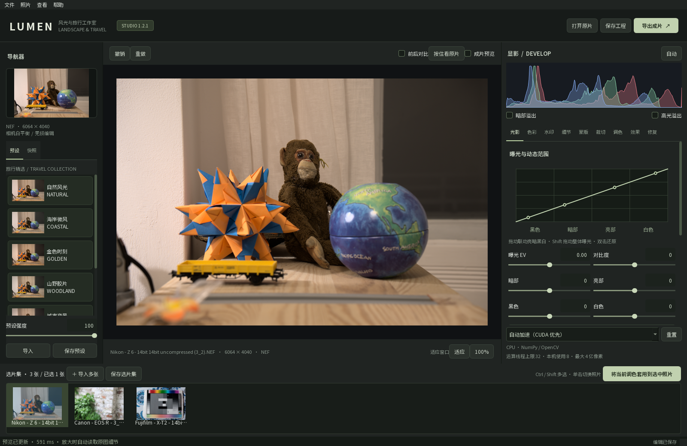

# LUMEN RAW · 多品牌 RAW 工作室

**开源多品牌 RAW 照片编辑器，集调色、AI 增强、智能蒙版与照片合成于一体。**

[English](README.md) · [下载发布版](https://github.com/hety0211/lumen-raw/releases) · [参与贡献](CONTRIBUTING.md) · [MIT 许可证](LICENSE)

Windows 与 macOS 本地 RAW 编辑器，中文界面，无需账号。支持 Sony、Canon、Nikon、Fujifilm、Panasonic RAW，多图选片、非破坏性编辑、离线 AI 蒙版与超分、16-bit TIFF / 线性 DNG。适用于 Windows 10 22H2 / Windows 11 x64，以及 Apple 芯片（M1 及更新）的 macOS 15 Sequoia 或更新版本。



截图使用公开 CC0 测试样片，[图片来源](docs/screenshots/README.md)。

## macOS 版（Apple 芯片）

1.3.1 起提供 Mac 版 [`LumenRAW-1.3.1-macOS-arm64.dmg`](https://github.com/hety0211/lumen-raw/releases/tag/v1.3.1-macos)，适用于 M1 及更新的 Apple 芯片、macOS 15 Sequoia 或更新版本（所有 Apple 芯片 Mac 都可免费升级到 macOS 15）；功能、工程和选片集格式与 Windows 版一致。

- **安装：** 双击 DMG，把 **LUMEN RAW** 拖到「应用程序」文件夹，然后从启动台或「应用程序」打开。
- **首次打开：** 安装包使用临时签名，没有 Apple 开发者证书公证，首次打开会被系统拦截。点「完成」后打开「系统设置 → 隐私与安全性」，在页面下方找到 LUMEN RAW 并点「仍要打开」，确认一次即可。也可以在终端执行 `xattr -dr com.apple.quarantine "/Applications/LUMEN RAW.app"`。
- **GPU 加速：** Windows 上由 DirectML 处理的逐像素显影（白平衡、曝光、亮暗部、HSL、曲线、色彩分级等），在 Mac 上由 **Metal** 计算着色器在 GPU 上运行；AI 超分、去杂色和自动蒙版通过 ONNX Runtime 的 **Core ML** 在 Apple GPU（Metal）上运行，代替 Windows ML 与 TensorRT for RTX。两者首次使用都会核对结果，失败时自动回退 CPU；底部中间显示 `GPU⚡` 或 `CPU⚡（线程数）`。RAW 解码、去薄雾、清晰度、纹理、锐化、传统降噪和修复仍在 CPU 上运行。
- **操作：** 快捷键用 ⌘ 代替 Ctrl（⌘O 导入、⌘S 保存、⌘E 导出、⌘Z 撤销、⌘⇧Z 重做），仿制图章用 **Option + 单击**取样。触控板双指滑动平移、捏合缩放、双指轻点两下适应窗口；鼠标滚轮或 ⌘ + 双指滑动缩放。可在 Finder 中右键照片 →「打开方式」选择 LUMEN RAW，或拖到程序坞图标上打开。
- **文件位置：** 日志在 `~/Library/Logs/LUMEN RAW`，GPU 兼容记录在 `~/Library/Application Support/LUMEN RAW`。ExifTool 使用系统自带的 Perl 运行。

在 Mac 上从源码运行或自行打包需要 Python 3.12（python.org、Homebrew 或 uv 均可）：

```bash
./run-source.command          # 首次会创建 .venv-macos、安装依赖并恢复模型资源
./build-macos.command         # 测试、Metal / Core ML 自检、打包 .app 与 DMG
```

Python 不在 `PATH` 时可加参数，如 `./build-macos.command --python /path/to/python3.12`。输出位于 `.publish/v131/macos/`，含 DMG、`SHA256SUMS-macOS.txt` 与全部日志。`LUMEN_COMPUTE=cpu` 可强制使用 CPU，`LUMEN_COREML_UNITS=ALL` 允许 Core ML 同时使用神经网络引擎。

## 1.3.1 更新

- **NVIDIA 显卡：** Windows 11 24H2 及以上、GeForce RTX 30 系及更新显卡，AI 超分、去杂色和自动蒙版通过 Windows ML 使用 NVIDIA TensorRT for RTX（首次使用时由 Windows 下载，之后离线可用）；其他电脑仍用 DirectML，最后回退 CPU。
- **AI 不再导致闪退：** 神经网络模型在独立后台进程运行。显卡驱动崩溃时编辑器继续运行，自动换下一种设备重算，并记住这块显卡与驱动版本的组合。
- 运行库改为 Windows ML 版 ONNX Runtime（`onnxruntime-windowsml` 1.30，内置 CPU 与 DirectML）。

## 1.3.0 更新

- **预览更快：** 显影流程按修复／显影、光影、空间细节、色彩分阶段缓存，拖动滑块只重算其后的阶段；局部调整只计算蒙版覆盖范围（按滤镜半径补足上下文）。两者结果都与整幅重算逐像素一致。
- **更多步骤用 GPU：** 除光影外，饱和度／自然饱和度、八色 HSL、RGB 与单通道曲线、黑白和色彩分级也通过 DirectML 运行；没有使用清晰度等空间细节工具时，光影与色彩合并为一次 GPU 处理。
- **显式任务状态：** 读取、导出、AI／合成、蒙版识别、预览、原图细节和缩略图由同一张冲突表与同一个任务调度器管理。
- 诊断日志位于 `%LOCALAPPDATA%\LUMEN RAW\logs`。设置环境变量 `LUMEN_COMPUTE=cpu` 可强制使用 CPU；CuPy 改为实验功能，需 `LUMEN_EXPERIMENTAL_CUPY=1` 才启用。

安装版沿用原 AppId，可直接覆盖安装 1.2.x，工程与选片集格式不变。

## GPU 加速

Windows 上可通过 DirectML 使用 AMD 显卡处理逐像素显影（曝光、白平衡、亮暗部、HSL、曲线、色彩分级等），以及 ONNX 超分、AI 去杂色和自动蒙版。程序优先选专用显存最多的独显，首次推理核查 GPU 是否真的执行节点；失败则自动退回 CPU。底部中间显示 `GPU⚡` 或 `CPU⚡（线程数）`，鼠标悬停可看设备与回退原因。RAW 解码、去薄雾、清晰度、纹理、锐化、降噪和修复仍在 CPU 上运行。

源码环境先按下方说明安装通用依赖和资源，然后在 Python 3.12 x64 环境切换到 DirectML 运行库：

```powershell
.\.venv\Scripts\python.exe -m pip uninstall -y onnxruntime onnxruntime-directml
.\.venv\Scripts\python.exe -m pip install -r requirements-directml.txt
.\.venv\Scripts\python.exe main.py
```

[GitHub 发布页](https://github.com/hety0211/lumen-raw/releases/latest)提供 `LumenRAW-1.3.1-Setup.exe` 和 `LumenRAW-1.3.1-Windows.zip`；`SHA256SUMS.txt` 可核对下载是否完整。本地重建输出在 `.publish\v131\packages\`。安装版采用当前用户安装，不需管理员权限；便携版解压后运行 `LumenRAW-Windows\LumenRAW.exe`。两个包均未签名。实机验证范围见 [TEST_REPORT.md](TEST_REPORT.md)。

自行重建时，`build-directml.ps1` 会先确认 GPU 节点实际执行，再生成便携程序；`installer.iss` 由 Inno Setup 7 生成安装程序。环境不在 `.venv` 时可传入 `-PythonPath`。

## 从 GitHub 源码运行

Git 仓库保存程序源码、测试、模型来源和许可证；大型模型、字体及 ExifTool 放在 Release 的 `LumenARW-1.2.1-RuntimeAssets.zip` 中。安装 Python 3.12 x64 后：

```powershell
git clone https://github.com/hety0211/lumen-raw.git
cd lumen-raw
py -3.12 -m venv .venv
.\.venv\Scripts\python.exe -m pip install -r requirements.txt
.\.venv\Scripts\python.exe tools/fetch_assets.py
.\.venv\Scripts\python.exe main.py
```

资源脚本会核对整个压缩包及每个资源文件的 SHA-256。首次需要约 600 MB 下载，此后编辑可离线运行。已经下载资源包时，可执行 `python tools/fetch_assets.py --archive 资源包路径`；`--verify-only` 只做本地校验。首次恢复资源后，也可通过 `run-source.cmd` 启动。

## 安装与运行

- **安装版：** 双击 `LumenRAW-1.3.1-Setup.exe`，按向导安装到当前用户目录，在开始菜单启动。无需管理员权限，可选桌面快捷方式，可通过 Windows「已安装的应用」卸载。升级前保存选片集并退出旧程序。
- **便携版：** 解压 `LumenRAW-1.3.1-Windows.zip`，进入 `LumenRAW-Windows`，双击 `LumenRAW.exe`。保留旁边的 `_internal` 文件夹，不能只移动 exe。
- **源码：** GitHub 的 Source code 压缩包或 `git clone` 提供代码；运行前按上方步骤恢复大型资源。Release 运行包则已包含全部资源。

两种运行包均包含 Python 运行环境、ExifTool、ONNX Runtime DirectML（可回退 CPU）、四个选区模型、两种 Real-ESRGAN 超分模型、DRUNet / NAFNet / FFDNet 三种去杂色模型，可完全离线使用。安装包目前没有商业代码签名证书。

## 1.2.1 · 图集合成

底部图集按 **Ctrl / Shift** 选择 2–32 张照片，右键 → **合成** → 选择方法；也可从「照片 → 合成」进入。独立窗口提供参考照片、预览、完整处理、保存目录、自动裁边、进度与取消。执行时优先处理合成，暂停新的预览和缩略图任务。

| 合成方法 | 算法与选项 |
|---|---|
| 景深合成 | 自动对齐后按多尺度清晰度选择不同焦平面的细节，并羽化边界；适合稳定构图的静物 |
| HDR 堆栈 | OpenCV **Mertens exposure fusion** 多尺度曝光融合；去伪影提供低、中、高，运动区域使用匹配曝光后的参考帧内容再参与融合 |
| 全景合成 | SIFT 特征匹配、相机优化、球面投影、重叠曝光补偿与分块羽化；画布最多 **2 亿像素**，超过时在分配画布前等比缩小 |

默认参考照片是**原始像素最多的一张**，同尺寸取列表中间帧，也可在窗口手动指定。结果命名为 `参考原名-景深合成.dng`、`参考原名-HDR堆栈.dng`、`参考原名-全景合成.dng`；同名自动加编号，完成后自动显示在底部图集并打开继续编辑。

默认统一使用参考照片的显影基准，保留包围曝光差异。勾选「使用每张照片的当前调色、蒙版、修复和裁切」可合成已有编辑；不同照片的局部编辑可能造成不连续。生成的是 **16 位线性 RGB DNG 成片**，继承参考照片的拍摄信息和水印配置；水印只在最终导出时添加。Mertens 生成自然曝光成片，不生成场景辐射度 HDR。

右键 → **删除（从图集移除）**只移除图集条目，**不会删除磁盘原片**。所选照片有未保存编辑时会询问是否先保存选片集；列表增删也会提示保存，可以保存和重新打开空选片集。

合成使用 CPU / OpenCV，遵守最多 32 个计算线程。全景应有约 30% 以上重叠，并尽量围绕同一视点拍摄；较大视差、运动或重复纹理仍可能产生接缝。景深合成不能保证消除焦点呼吸和透明物体边缘问题。HDR 去伪影越高，越依赖参考帧；参考帧中丢失的运动细节不能恢复。HDR / 景深使用整图原生中间缓冲，会先检查可用内存，像素上限不代表任意照片数量都能同时处理。取消整图融合或 DNG 保存时，需要等待当前步骤结束。

## 保留的 1.2 功能

- **线程上限 32：** 根据本机逻辑处理器数量使用 1–32 个计算线程。图像任务依次调度，AI 优先，避免多个原生线程池同时抢占资源。关闭窗口会等待正在运行的任务收尾，界面保持响应。
- **曝光曲线（1.4.1 起无极调节）：** 光影页曲线上任意位置上下拖动，曲线在该亮度附近平滑弯曲，指针下的点准确跟随，远处亮度保持不变；同时只有该亮度范围对应的黑色／暗部／亮部／白色滑块朝拖动方向联动。四个滑块单独无法做出局部弯曲，剩余部分记录为一条精细曲线（随工程、预设和撤销保存，在 RGB 曲线之前应用，CPU 与 GPU 结果一致）。按住 Shift 拖动调整整体曝光；双击曲线恢复曝光、四个分区和精细曲线，保留对比度。旧工程没有精细曲线，显示与渲染不变。
- **工具页调整：** 水印与光影、色彩平级；RGB / R / G / B 节点曲线移入色彩页，原有曲线编辑保留。
- **高画质 AI：** 超分默认 Real-ESRGAN x4plus / RRDB，去杂色默认 DRUNet，并提供面向真实噪声的 NAFNet SIDD。旧 compact / FFDNet 作为快速选项保留。采用重叠羽化分块，高画质预览与整图使用相同分块网格和原图上下文。新模型计算量更大，实际效果取决于照片与强度，建议先预览。
- **4 亿像素上限：** 2× / 4× 增强后的总像素、导出及水印边框都计入上限。大图基础调色与 AI 输出使用磁盘映射，DNG / TIFF 按条带编码。已实际验证 20,000 × 20,000 的基础调色与 DNG 导出读回；未进行 4 亿像素整图神经推理测试。

## 保留的 1.1 功能

- **多品牌导入：** Sony ARW / SR2 / SRF，Canon CRW / CR2 / CR3，Nikon NEF / NRW，Fujifilm RAF（含 X-Trans），Panasonic RW2 / RAW，以及 DNG。导入窗口提供分品牌筛选，拖入和底部选片也使用同一解码流程。已实测 CR2、CR3、NEF、X-Trans RAF、RW2；具体新机型和压缩方式仍以内置 LibRaw 支持为准。内置 LibRaw 无法解码的压缩（如尼康 Z8 / Z9 的“高效率 / 高效率★” NEF）自 1.4.1 起改用文件内嵌的全尺寸 JPEG 打开（8 位 sRGB，界面标注“内嵌 JPEG”）；佳能 HDR PQ 拍摄的 CR3（如 EOS R5 Mark II）内嵌 HEVC 预览，1.4.1 起用 OpenCV 自带的 FFmpeg 解码并由 PQ 转为 SDR，用于缩略图和相机参考显影。
- **工具页「水印」：** 四种边框预设——画廊白、暗夜黑、旅行纸、山野绿。上下左右可单选或组合，边框宽度可调，显示拍摄时间、机身、镜头、光圈、快门、ISO，可选焦距和品牌文字。缺失信息显示“未记录”，拍摄时间直接来自 EXIF，软件不推测相机时钟是否正确。
- **标志素材：** 内置的是通用字体品牌名称，没有内置未经明确授权的官方图形 LOGO。可分别导入有权使用的机身／镜头 PNG 标志（每个小于 2MB、最长边 2048px），标志随工程保存。
- **主体与近景蒙版：** 主体使用 U2NetP 识别显著对象，背景为其反选；近景使用 MiDaS 相对深度选择较近区域。近景不是固定选取画面下方。没有明确主体时会提示，可继续用颜色点选或画笔处理；深度估计不保证对水面、玻璃等场景准确。
- **独立 AI 窗口：**「照片 → AI 超分辨率 / AI 去杂色」，或细节面板按钮。窗口提供中央原图细节前后预览、强度或倍率、保存目录、进度与取消。运算期间暂停新的预览／缩略图任务，等待已开始的任务结束后优先处理 AI。
- **自动生成副本：** 完成后保存 `原名-增强.dng` / `原名-去杂色.dng` 并加入底部选片栏，同名自动编号。默认保存到原片目录；只读卡或目录请改选可写目录，也可输入相对目录。原片与原编辑状态保留。
- **空窗口浏览：** 没有导入照片也可切换所有工具页、滚动说明、打开水印和 AI 窗口；图像参数和执行按钮禁用。

AI 副本为已经应用当前调色、蒙版、修复和裁切的 **16 位线性 RGB DNG**，可继续编辑；原片工程保留原有步骤。水印不会写进 AI 副本像素，只在最终导出时加在画面之外。副本内嵌拍摄信息供 Lumen 水印读取，这不是完整复制原片 MakerNotes / EXIF。请保存选片集以保留所有照片和副本的后续编辑。

去杂色处理显影后的 RGB。DRUNet / FFDNet 根据原图估算噪声，35 为参考强度；NAFNet SIDD 默认混合强度 70。高画质预览使用整图的噪声参考与上下文。强度过大可能损失纹理。它不是 Adobe 的传感器级 AI 降噪。便携版和安装版离线运行，模型优先使用 DirectML，失败时回退 CPU；CUDA 接口可在源码环境启用。

## 保留的编辑功能

| 功能 | 使用方法与行为 |
|---|---|
| 原图细节缩放 | 点击 **100%** 或滚轮放大，后台解码全尺寸原片，完成后替换预览。100% 为一个源像素对应一个屏幕物理像素。当前照片缓存原图，继续缩放、平移无需重新解码 |
| 自动蒙版 | 蒙版 → **天空 / 人物 / 主体 / 背景 / 近景**，使用本地开源识别模型。背景为显著前景的反选。支持反选、羽化、不透明度和画笔补画／擦除 |
| 相似颜色点选 | 点击「点选相似颜色区域」后点击照片，按 Lab 色差扩展相邻连通区域，容差越大范围越宽 |
| 回车裁切 | 裁切面板按 **Enter** 或点击确认后，只显示保留部分；「重新裁切」恢复原画面。确认后仍可在其他面板绘制蒙版和修复 |
| DNG 成片 | 导出 → **DNG · 16-bit 线性成片**，保存已应用编辑、蒙版和裁切的线性 RGB，可由本软件重新打开 |
| 修正 RAW 偏暗 | 新开 RAW 从内嵌相机 JPEG 提取亮度参考曲线，曝光仍从 0 EV 开始；光影面板可切回线性显影，旧工程保持旧效果 |
| 多图与套用 | 一次打开／拖入多张照片；底部单击切换，**Ctrl / Shift** 多选，点「将当前调色套用到选中照片」 |

**套用范围：** 曝光、亮暗部、冷暖微调、HSL、曲线、细节、色彩分级、黑白和效果。保留目标照片自己的水印、裁切、蒙版、修复、相机 K 基准、白平衡取样和相机参考显影曲线。Ctrl / Shift 多选不会切换当前调色来源。

**DNG 说明：** 输出为 DNG 1.4 LinearRaw，包含已经编辑的 16-bit 线性 sRGB 三通道像素，**不是原始传感器马赛克数据的无损封装**。继续保存相机 RAW 与 `.lumen` / `.lumenalbum`，才能保留原始数据和可修改步骤。已用 LibRaw 和 ExifTool 检查，尚未在 Adobe Lightroom 中实测兼容性。

**亮度说明：** 参考相机 JPEG 的整体亮度分布，不复制全部相机色彩风格、局部处理或镜头校正。没有可用预览时采用备用曲线。三张用户提供的 A7 III 原片已逐张检查，预览和全尺寸亮度一致，原片保持不变。

## 编辑流程

1. 导入照片，选择左侧风光旅行预设或「自动」。预设支持强度、自定义导入／保存；快照可保存不同版本。
2. 光影、色彩、水印、细节、蒙版、裁切、调色、效果、修复九个面板提供全部编辑。数字可直接输入，双击滑轨恢复默认。
3. 色彩页中的 RGB / R / G / B 曲线可在任意亮度位置按下、上下拖动建立节点；右键删除中间节点。输入／输出框覆盖 0–255，最多 256 节点，支持平滑曲线或折线。
4. 白平衡优先读取相机记录色温。Sony 自动白平衡有时只记录通道增益，界面会显示「估算基准 ≈」，不把估算当作相机记录；始终以相机白平衡增益解码。K 保持基准时不额外改变像素。
5. 细节提供去薄雾、清晰度、纹理、锐化、明度／彩色杂点降噪。放大至 100% 检查实际像素，首次原图读取会显示状态提示。
6. 污点修复可点击／涂抹灰尘；仿制图章用 **Alt + 单击**取样，再涂抹目标。支持直径、羽化、不透明度、单笔隐藏／删除和撤销。修复为邻域填补，不是生成式移除。
7. 蒙版支持画笔、线性渐变、径向、亮度范围与自动选区。勾选「画笔修整自动蒙版」可修正边缘；识别可能误选或漏选，请检查紫色覆盖。
8. Enter 确认裁切，前后对比检查效果。滚轮缩放、中键平移、「适应」恢复整幅构图。
9. **保存选片集**把底部全部照片的编辑存入 `.lumenalbum`；`Ctrl+S` 保存当前 `.lumen`。两种文件都只引用原片，请一同保留。切换照片保留会话内修改，关闭前需保存，尚无自动目录数据库。
10. 导出重新读取全尺寸原片并应用全部编辑。JPEG / PNG 为 8-bit，TIFF 为 16-bit，均嵌入 sRGB ICC；DNG 为 16-bit 线性 RGB。2× / 4× 超分先在独立 AI 窗口生成副本。

快捷键：`Ctrl+O` 导入，`Ctrl+S` 保存当前工程，`Ctrl+E` 导出，`Ctrl+Z` 撤销，`Ctrl+Shift+Z` 重做，`Ctrl+0` 适应，`Enter` 确认裁切，`Y` 前后对比，`J` 剪切提示，`Esc` 取消白平衡吸管。

1.3.0 沿用版本 5 编辑配方，与 1.2.0 / 1.1 兼容，可读旧版 1 / 2 / 3 / 4 工程；1.0 及更早程序无法读取版本 5 工程。旧工程仍保持线性显影，可在光影面板主动切换相机参考显影。

## 超分与 CUDA

「照片 → AI 超分辨率…」提供实际原图中央细节预览。高画质 `RealESRGAN_x4plus`（23 个 RRDB）与快速 `realesr-general-x4v3` 模型均原生 4×，2× 在每块 4× 输出上按面积缩小；支持分块进度和取消。源码处理接口保留传统增强与自定义 ONNX。它处理显影后的 RGB，不是 Adobe RAW 增强算法；生成纹理可能偏离真实细节。

内置包使用 DirectML（AMD 实测，无可用 GPU 时回退 CPU）。可选 CUDA 源码运行：先安装 Python 3.12 x64，运行 `run-source.cmd`，然后在源码目录执行：

```powershell
.\.venv\Scripts\python.exe -m pip uninstall -y onnxruntime onnxruntime-directml
.\.venv\Scripts\python.exe -m pip install --no-cache-dir -r requirements-gpu.txt
.\.venv\Scripts\python.exe main.py
```

GPU 配置为 ONNX Runtime GPU 1.23.2、CUDA 12.x / cuDNN 9、CuPy CUDA 12，需要兼容的 NVIDIA 驱动和运行库。不要同时安装 CPU 与 GPU 两种 ONNX Runtime 或多个 CuPy 发行包。

- 逐像素显影图、神经超分、三种 AI 去杂色和自动蒙版可用 ONNX CUDA provider，初始化失败回退 CPU。CuPy 光影为实验功能，需设置 `LUMEN_EXPERIMENTAL_CUPY=1`。
- RAW 解码、HSL、去薄雾、清晰度、锐化、传统降噪和修复仍用 CPU。
- **本次已验证 CPU 实际推理，未在 NVIDIA GPU 实机验证 CUDA。**

自定义超分模型需单输入 `float32 NCHW / RGB / 0–1`、动态宽高，首个输出为所选 2× / 4×。分块为 192px，上下文 40px，更大感受野可能出现接缝。模型许可证由提供方决定。

## 使用边界

- 三张测试 ARW 首次原图读取约需 3–6 秒，其他电脑可能不同。缓存为整幅浮点图，大图建议 32GB 内存，只保留当前照片的原图缓存。
- 输出上限 4 亿像素（含边框）；2× 宽高为 4 倍像素，4× 为 16 倍。24MP 的 4× 约为 3.84 亿像素，加边框后可能超限。
- 4 亿像素单个浮点缓冲约 4.5 GiB，需要充足的临时磁盘空间；CPU 高画质 AI 可能耗时很长。去薄雾、清晰度、蒙版、修复等空间类编辑仍需整图内存，会先估算资源并在不足时提示。像素上限不保证所有编辑组合都能在任意电脑运行。
- 自动选区在缩小图识别、细化边缘，再映射到原图；不保证发丝、树枝、半透明物体等精细分割。背景依赖显著前景，不是所有照片都有明确主体。
- 修复在不同分辨率重新计算，细小灰尘应在 100% 检查。最多 500 个修复笔划、32 个蒙版。
- 完全过曝的信息不能保证恢复。K 调整用相对光源 RGB 增益近似，没有 Adobe 相机配置或镜头配置。
- 8-bit 输入按 ICC 转 sRGB；16-bit PNG/TIFF 假设为 sRGB。输出不完整复制原片 EXIF / GPS；AI DNG 副本保存供 Lumen 读取的拍摄信息。尚无显示器 ICC 软打样。
- 不读取 Lightroom 目录或 Adobe XMP 预设。多图同步和批量导出（1.4.1，底部图集多选后右键，可选格式与长边尺寸，不含 AI 超分）已实现，打印和镜头配置尚未提供。
- 已实测 Sony A7 III、A7R V、Canon EOS R / Rebel SL1、Nikon Z 6、Fujifilm X-T2、Panasonic DC-S1；其他机型与压缩方式由 LibRaw 支持范围决定。

## 开发与构建

```powershell
.\.venv\Scripts\python.exe -m pip install --no-cache-dir -r requirements-dev.txt
.\.venv\Scripts\python.exe -m pytest tests -q
powershell -ExecutionPolicy Bypass -File build.ps1
# 安装 Inno Setup 7 后，从源码目录编译安装版：
ISCC.exe /DAppBuild=dist\LumenRAW installer.iss
```

实际原片检查可用 `python main.py --smoke-test C:\Photos\sample.ARW .\diagnostics`。1.0 风光流程可用 `python main.py --release-test .\release-diagnostics C:\Photos\one.ARW C:\Photos\two.ARW`，针对含天空的风光照片检查原图缩放、天空、裁切、同步、DNG 和选片集。

多品牌与高画质 AI 副本检查可用 `python main.py --workflow-test .\workflow-diagnostics C:\Photos\one.ARW C:\Photos\two.CR3`，会在诊断目录生成测试副本，原片只读。

合成检查可用 `python main.py --merge-test .\merge-diagnostics C:\Photos\one.ARW`。它从单张照片生成受控曝光、焦平面和投影视图，验证三种合成、图集与 DNG 流程；这不是实际拍摄的多张序列测试。诊断目录应使用尚未运行过的新目录。

验证记录见 `TEST_REPORT.md`。模型来源、许可和校验值见 `MODEL.md`、`THIRD_PARTY.md`、`assets/models/model-info.json`、`selection-models.json` 、`v11-models.json` 及 `v12-models.json`。
